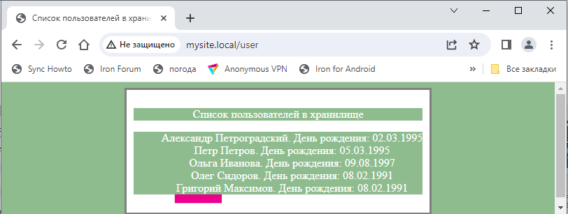

# PHP BASICS. Workshop 6. Homework. Тогочакова Евгения

-Мы стали работать с исключениями. Создайте в Render логику обработки исключений так, чтобы она встраивалась 
в общий шаблон. Вызов будет выглядеть примерно так:

try{
$app = new Application();
echo $app->run();
}
catch(Exception $e){
echo Render::renderExceptionPage($e);
}

— Создайте метод обновления пользователя новыми данными. Например,

/user/update/?id=42&name=Петр

Такой вызов обновит имя у пользователя с ID 42. Обратите внимание, что остальные поля не меняются. 
Также помните, что пользователя с ID 42 может и не быть в базе.

— Создайте метод удаления пользователя из базы. Учитывайте, что пользователя может не быть в базе
/user/delete/?id=42

